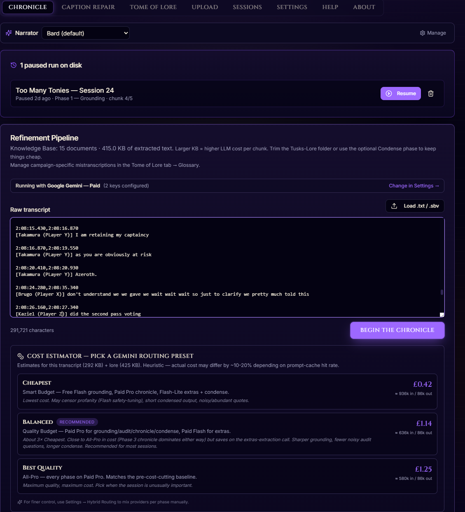

<div align="center">

# 📜 Tusk's Tomes

### Turn any D&D, Pathfinder, or TTRPG session recording into a polished AI narrative chronicle, session recap, and summary — automatically, overnight, on your own machine.

**Local-first AI session chronicler. Open source. MIT-licensed. Free forever.**

[](LICENSE)
[](https://nodejs.org/)
[](https://www.typescriptlang.org/)
[](AddOns.md)
[](https://github.com/KochiTusker/Tusks-Tomes/commits/main)
[](https://kochitusker.github.io/Tusks-Tomes/)

*Like a personal scribe for your D&D table — paste a transcript or drop a Craig recording, walk away, wake up to a chronicle.*

**🌐 [Tusk's Tomes website and documentation](https://kochitusker.github.io/Tusks-Tomes/)** — what it does, what it costs, and how to install it.

<p>
  <a href="https://docs.google.com/forms/d/e/1FAIpQLSdxdqOhb1SQvI3fs50gMJv_Cesh2MuxUm95QO2iZia5sFhyyQ/viewform?usp=header" target="_blank"></a>
  &nbsp;
  <a href="https://buymeacoffee.com/kochitusker" target="_blank"></a>
</p>



</div>

## 📖 Why this exists

I wanted a record of my campaign. Not minutes — the actual story. The bit where
the plan fell apart in an interesting way, the joke that had everyone crying,
the line the DM delivered that made the table go quiet for a second.

Everyone at every table says they'll write it up. Almost nobody does. I managed
it once.

The obvious tools didn't fit. Meeting transcribers are built for standups: you
get a transcript and some bullet points about what was "discussed", for £15 a
month, forever, processed in someone else's cloud. And none of them have the
faintest idea who your characters are — they hear an invented fantasy name,
guess a spelling, and then use that guess with total confidence for four hours
straight.

So I wrote this instead. It's a **self-hosted, open-source AI session
chronicler for D&D, Pathfinder and any other tabletop RPG**: it turns a session
recording or transcript into a narrative chronicle, a session summary you can paste
into Discord, and a list of the lines worth remembering — grounded in *your*
glossary of names and lore rather than the model's generic fantasy filler.

It works with cloud LLMs (Gemini, Claude, OpenAI), a Claude Code or Codex
subscription you already pay for, or fully offline via local models (Ollama, LM
Studio, Unsloth). Feed it pasted text, YouTube `.sbv` captions, Zoom or phone
audio, or a [Craig](https://craig.chat) Discord recording via the Whisper
add-on.

It's a niche tool for a niche group of people, and I'm fine with that. If
you're one of them, hello.

### 👥 You'll probably get on with this if…

- You're a **GM or DM** with a backlog of un-written-up sessions you've stopped mentioning out loud.
- Your group plays over **Discord with [Craig](https://craig.chat)**, and you want per-speaker, per-character attribution that survives all the way to the finished text.
- You **play solo** and record your own narration — same pipeline, and the prompts don't assume a party.
- You make **actual-play content** — a podcast, a Twitch or YouTube stream — and want episode recaps, show notes and quote pulls without re-watching a four-hour VOD. Streamers get a session summary per episode without paying an editor to listen back.
- You archive campaigns on **Roll20, Foundry or Fantasy Grounds** — paste the chat log, no audio needed.
- You're **not comfortable uploading your friends' voices** to a SaaS. Entirely fair. Nothing here leaves your machine except the text you choose to send to a model.
- You'd **rather spend ~£1.50 of your own API credit** on a session than £15 a month, forever, on a subscription.
- You play **anything at all**: D&D 5e, Pathfinder 1e/2e, Call of Cthulhu, Blades in the Dark, Vampire, Daggerheart, Fabula Ultima, OSR retroclones, homebrew. Nothing in the pipeline assumes a rules set.

**A fair warning before you get excited:** this is one person's project, tested
on one Windows PC, and it currently expects you to be comfortable installing
Node.js and running a `.bat` file. [How safe is this?](docs/is-this-safe.md)
lays out exactly what it installs, what it changes, and what could go wrong.

---

## 🎬 See it in action — from setup to chronicle in four steps

The full journey from a fresh install of Tusk's Tomes to a saved `.docx` D&D session chronicle, in four screenshots:

### 1. Configure once — paste a Gemini, Claude, or OpenAI API key


*One paid API key gets you running. Keys are AES-256-GCM encrypted at rest, machine-bound via scrypt — they cannot be moved off your computer, even if the file is copied. The free-tier Gemini slot is optional and only used by the Smart Budget extras phase.*

### 2. Drop in a Craig multitrack Discord recording (or any audio file)


*Craig multi-track gives you per-speaker FLAC files; Tomes feeds each track to a local Whisper sidecar so every line in the chronicle is attributed to the right player. No audio ever leaves your machine.*

### 3. Map Discord usernames to D&D characters and players


*This is the bit general transcription tools have no way of doing — per-speaker, per-character attribution that survives to the finished text. Set it once at the start of a campaign and it persists.*

### 4. Watch the 6-phase AI chronicler pipeline run


*Walk away. Come back to a `.docx` chronicle, a recap for Discord, and the quotes worth keeping. On a real 3-hour session the pipeline takes about half an hour; add 20–30 minutes before that if Whisper is transcribing the audio too.*

*A full walkthrough video is on the [roadmap](ROADMAP.md); for now, a step-by-step text walkthrough lives at [docs/walkthrough.md](docs/walkthrough.md).*

---

## ⚔️ What Tusk's Tomes does

Tusk's Tomes is a **locally-hosted AI session chronicler for tabletop RPGs** — a desktop app that turns a D&D, Pathfinder, or any-TTRPG session transcript into a polished narrative recap grounded in *your* glossary and *your* campaign lore — not the model's generic fantasy hallucinations. Plug in any cloud LLM (Gemini, Claude, or OpenAI), point it at a transcript, get back a chronicle plus a curated list of quotes, jests, and gore.

**Input options:** pasted transcript text · YouTube `.sbv` captions · `.docx` / `.pdf` notes · Discord voice recordings via [Craig](https://craig.chat) (multi-track FLAC zip — Audio Transcription add-on) · raw `.flac` / `.wav` / `.mp3` files.

**Output:** a saved `.docx` chronicle + an in-app browser view + the source transcript (cleaned, ground-truth speakers + names corrected) + optional bullet condensation + extracted quotes / jests / gore lists.

**How the pipeline works (6 phases, one click):**

```
Transcript ──► Phase 1 ──► Phase 2 ──► Phase 3 ──► Phase 4 ──► Phase 5 ──► Phase 6 ──► Chronicle
              Ground       Audit       Chronicle    Extras      Polish      Condense    (.docx
              (speakers    (DM         (narrative   (quotes,    (local-     (optional   + .md
              + lore)      questions)  prose)       jests,      LLM only)   shorter      + on-screen)
                                                    gore)                   recap)
```

**Mix models, and recover when one underperforms.** Assign different phases to different providers (Hybrid Routing), and when a finished chronicle's extras or recap come out weak — or a provider declined the spicier moments — use **🪄 Chronicle Reforge** to re-run just the later phases on a different model (e.g. let Claude write the prose, then redo quotes/jests/gore and the condensed recap on Gemini). If a provider declines individual chunks, they're flagged in the output and a one-click **repair** re-processes only those on another provider. See [docs/reforge.md](docs/reforge.md).

**The three convictions this project is built on:**

1. 🛡️ **Local-first beats SaaS subscriptions.** Your decades-long homebrew should never disappear because a startup pivoted. Your lore, your keys, your hardware, your rules.
2. ✍️ **AI should empower creativity, not replace it.** Tomes is a *scribe*, not a co-DM — it writes down what your players said, not what it thinks they should have said.
3. 🎲 **Tools for tables, not paywalls.** Built for kitchen-table games and small Discord servers. MIT-licensed. No subscription, no account, no telemetry, no rug-pull risk.

---

## 🆚 How Tusk's Tomes compares to Otter.ai, Descript, and NotebookLM

| | Tusk's Tomes | Otter.ai / Read.ai | Descript | NotebookLM | ChatGPT-only |
|---|---|---|---|---|---|
| **Cost** | Free & open-source software; pay only for your chosen LLM API (~£1.50–£3/session) | £15+/month subscription | £15+/month | Free tier (Google account) | $20/month |
| **Privacy** | Local-first, your machine | SaaS, audio uploaded | SaaS, audio uploaded | Google servers | OpenAI servers |
| **TTRPG-aware** | Yes — glossary, speaker names, lore grounding | No — generic meeting transcripts | No — generic video editing | Generic notebook tool | Generic chat |
| **Per-speaker attribution** | Yes via Craig multi-track | Voice diarisation (often wrong) | Manual labelling | No | No |
| **Narrative chronicle output** | Yes — `.docx` + on-screen prose | Bullet meeting notes only | Edit-the-audio focus | Q&A over notes | Whatever you prompt |
| **Multi-LLM** | Gemini + Claude + OpenAI + local | Single proprietary model | Single proprietary model | Gemini only | OpenAI only |
| **Resumable** | Yes — pause & resume across days | No | No | No | No |
| **Open source** | MIT | Closed | Closed | Closed | Closed |
| **Offline mode** | Yes — Ollama / LM Studio | No | No | No | No |

If you want **a meeting transcript**, Otter is great. If you want **a narrative recap of your D&D session, written by a scribe who knows your party**, that's specifically what Tomes is for.

---

## 🛠️ Prerequisites

- **Node.js 20+** — [download from nodejs.org](https://nodejs.org/)
- **Git** — [download from git-scm.com](https://git-scm.com/)

That's it for the core install. Optional add-ons (Audio Transcription, Local LLMs, Personas) have their own prerequisites — see [AddOns.md](AddOns.md).

## 🚀 Quick start — install Tusk's Tomes

```sh
git clone https://github.com/KochiTusker/Tusks-Tomes.git
cd Tusks-Tomes
```

Then double-click `setup.bat` (Windows) or run `bash setup.sh` (macOS / Linux). The setup script handles `npm install` and `.env` scaffolding. Open <http://localhost:5173>.

Add at least one LLM API key in **Settings → API Keys** (Gemini / Claude / OpenAI) — encrypted at rest, machine-bound, never sent anywhere except to the provider.

🛡️ **First time setting up?** Glance at the [security quick reference](docs/security-quickref.md) — short, plain English, takes one minute. Covers what's safe by default, what you can change that might be less safe, and the residual risks we can't fix in code.

📖 **Full setup walkthrough, troubleshooting, and updating instructions:** [SETUP.md](SETUP.md)

---

## 💸 Cost

**Tusk's Tomes is free.** MIT-licensed, no subscription, no account, no telemetry, no paywall.

Tusk's Tomes itself is free and open-source — there's no payment to the project. The only money involved is your chosen **LLM API key**:

- **Gemini** — a paid (billing-enabled) Google API key is required for the main pipeline. ~£3 per 3-hour session on Gemini Pro; ~£1.50 on the Smart Budget preset; ~£0.70 on Flash everywhere (Budget mode). An optional free-tier Gemini key can be configured as a Smart Budget secondary that handles Phase 4 extras only. See [docs/providers.md](docs/providers.md).
- **Claude** — pay-as-you-go (~£0.05–£0.50 per session depending on model).
- **OpenAI** — similar to Claude.
- **Local LLMs** — zero cost (via the [Local LLMs add-on](AddOns.md#-local-llms)).
- **Claude Code subscription** — no API key; uses your own Claude Pro/Max plan via the [Claude Code add-on](docs/add-ons/claude-code.md). No per-session dollar cost, but it draws on your plan's rolling usage limits — **in testing, one full session used up to ~60% of a 5-hour usage window**, so plan for roughly one or two sessions per window (or hand the cheaper phases to another model via Hybrid Routing / Reforge).

> **Why a paid key is required.** When Tomes first launched, Google's free tier gave access to Pro-class Gemini models, which made a fully free workflow viable. Google has since moved Pro models behind billing, and free Flash on its own is too rate-limited to carry a 3-hour session's main pipeline. The project has been engineered to keep API costs as low as possible (prompt caching, audit-skip, per-tier chunk sizing, Smart Budget routing) — see [docs/providers.md → Making it cheaper](docs/providers.md#-making-it-cheaper--ongoing-cost-reduction-work) for the architectural details.

> **💡 Got a free-tier Gemini key?** Save it for [**Tusk's Vault**](https://github.com/KochiTusker/Tusks-Vault) — the upcoming AI-chatbot companion that lets you ask questions of your campaign lore in natural language. Vault's per-query token use is much lower than Tomes' six-phase pipeline, so a free quota fits its workload comfortably. Vault is due to release soon; if you're picking up a Google Gemini key primarily for the free tier, Vault is where it earns its keep.

---

## 🧩 Optional add-ons

The core install handles paste-a-transcript chronicling against any cloud LLM. Six opt-in add-ons extend it — install in one click from **Settings → Add-ons**:

- **🎙️ Audio Transcription** — Whisper sidecar + [Craig](https://craig.chat) multitrack ingest + direct audio drop-in. **Per-speaker attribution end-to-end** — every line in the chronicle is correctly assigned to the right player and character. Much better than YouTube `.sbv` workflows.
- **🦙 Local LLMs** — route any phase through Ollama / LM Studio / Unsloth. Fully offline if you want it; hybrid mix-and-match per phase if you want the cheap-and-good sweet spot.
- **🎭 Chronicle Personas** — swap the locked bardic narrator voice for one of six presets (Arnold, Homer, Peter, Gandalf, Mike Tyson, Donkey) or your own.
- **🤖 Claude Code (your subscription)** — power the pipeline with your own Claude Code (Pro/Max) plan instead of an API key. ⚠️ It's token-heavy — in testing one full session used up to ~60% of a rolling 5-hour usage window — so pair it with Reforge (below) to keep the cheaper phases on another model.
- **🧠 Codex (your ChatGPT subscription)** — the same idea for an OpenAI subscription: run phases through a locally-installed Codex CLI with no API key. Independent of the Claude Code add-on — install either, both, or neither.
- **🗂️ Obsidian Vault lore** — ground chronicles against an existing Obsidian vault instead of the Tusks-Lore folder. Read-only: the app reads your notes' frontmatter aliases and bodies, and never writes into the vault.

If a subscription add-on hits its usage window mid-run, the run pauses itself and resumes at the exact chunk it stopped on — nothing is lost.

📖 **Full add-on guide:** [AddOns.md](AddOns.md)

---

## 🎬 Walkthrough

The fastest way to understand what running Tomes feels like: read [docs/walkthrough.md](docs/walkthrough.md) — a step-by-step first-session guide from "I have a transcript" through "I have a finished chronicle saved to disk", including what happens if you hit a free-tier rate limit mid-run (you can pause now and resume tomorrow when the quota resets).

---

## 🤝 The Tusk's trio — Tomes, Vault, and Lore

Tusk's Tomes has two siblings, both auto-detected when they're dropped next to it on disk:

| Tusk's Tomes (this repo) | Tusk's Vault (coming soon) | Tusk's Lore |
|---|---|---|
| Records → transcribes → chronicles each session | Indexes the whole campaign and answers questions about it in Discord — releasing soon | Shared on-disk archive of finished chronicles + lore documents |
| Use case: "Write me a recap of Session 17" | Use case: "`@Tusk` who is Vellichor the Pale?" | Use case: "Save chronicles as `.docx` for both projects to read" |
| [github.com/KochiTusker/Tusks-Tomes](https://github.com/KochiTusker/Tusks-Tomes) | [github.com/KochiTusker/Tusks-Vault](https://github.com/KochiTusker/Tusks-Vault) (publishing imminently) | A folder Tomes creates for you — no separate repo |

Drop all three side-by-side on disk (e.g. `Documents/Tusks-Tomes/`, `Documents/Tusks-Vault/`, `Documents/Tusks-Lore/`) and they find each other automatically.

> **💡 Got a free-tier Gemini key?** Vault is the better home for it. Vault is a single retrieval-augmented query per turn — orders of magnitude lower token use than Tomes' six-phase generation pipeline — so a free Gemini quota carries Vault's workload comfortably. Tomes itself requires a paid key for the main pipeline (see [docs/providers.md](docs/providers.md)); a free key, if you have one, is optional in Tomes (Smart Budget extras only) and far more valuable on Vault.

📖 **Setup details:** [docs/vault.md](docs/vault.md)

---

## 📚 Documentation

Every page below is also published, searchable and cross-linked, on the
**[Tusk's Tomes documentation site](https://kochitusker.github.io/Tusks-Tomes/docs/)** — easier to read
and to search than the rendered markdown here.

The full docs live under [`docs/`](docs/) so this page stays readable. Headline destinations:

| Getting started | Using it | Reference |
|---|---|---|
| [Setup walkthrough](SETUP.md) | [First-session walkthrough](docs/walkthrough.md) | [Architecture](architecture.md) |
| [Beginner's guide](docs/beginner-guide.md) | [Workflows](docs/workflows.md) | [Configuration & disk layout](docs/configuration.md) |
| [Dependencies](docs/dependencies.md) | [Features](docs/features.md) | [Privacy & security](docs/privacy.md) |
| [LLM providers](docs/providers.md) | [Use cases](docs/use-cases.md) | [Pricing](docs/pricing.md) |
| [Add-ons](AddOns.md) | [Comparison to alternatives](docs/comparison.md) | [Tusk's Vault pairing](docs/vault.md) |
| [Audio Transcription](docs/add-ons/audio-transcription.md) | [FAQ](docs/faq.md) | [Security](.github/SECURITY.md) |
| [Local LLMs](docs/add-ons/local-llm.md) | [Chronicle Reforge](docs/reforge.md) | |
| [Chronicle Personas](docs/add-ons/personas.md) | | |
| [Claude Code (subscription)](docs/add-ons/claude-code.md) | | |

Project meta: [Roadmap](ROADMAP.md) · [Contributing](CONTRIBUTING.md) · [License](LICENSE)

---

## 💬 Community & feedback

<a href="https://docs.google.com/forms/d/e/1FAIpQLSdxdqOhb1SQvI3fs50gMJv_Cesh2MuxUm95QO2iZia5sFhyyQ/viewform?usp=header" target="_blank"></a>

A dedicated **Discord community** for Tusk's Tomes and [Tusk's Vault](https://github.com/KochiTusker/Tusks-Vault) is on the [roadmap](ROADMAP.md) — if there's enough interest, a server will be spun up for setup help, feature ideas, chronicle showcases, and dev talk. For now, the **feedback form above** is the fastest way to ask a question, request a feature, share a chronicle, or signal that you'd like to see a community Discord exist.

> **🌱 Early days.** The feedback collected now genuinely shapes what Tusk's Tomes becomes — and how big the community channel needs to be when it launches.

[**👉 Share feedback →**](https://docs.google.com/forms/d/e/1FAIpQLSdxdqOhb1SQvI3fs50gMJv_Cesh2MuxUm95QO2iZia5sFhyyQ/viewform?usp=header)

---

## 🛠️ Tech stack

TypeScript + a small Python sidecar (for the optional Audio Transcription add-on). Node 20+ runtime. Express + Vite middleware sharing one port. React 19 + Tailwind on the frontend. `@anthropic-ai/sdk` / `openai` / `@google/genai` for cloud LLMs, with adaptive per-provider pacing read from response headers. AES-256-GCM (machine-bound scrypt key) for the keystore.

📖 **Full architectural breakdown:** [architecture.md](architecture.md)

---

## ❤️ Support the project

**Free (30 seconds):** ⭐ [Star the repo](https://github.com/KochiTusker/Tusks-Tomes) · 💬 [Share feedback](https://docs.google.com/forms/d/e/1FAIpQLSdxdqOhb1SQvI3fs50gMJv_Cesh2MuxUm95QO2iZia5sFhyyQ/viewform?usp=header) · 🗣️ tell another DM · 📝 paste a chronicle into the form's "share a chronicle" question.

**Free (a bit more):** 🐛 file bug reports · 🔀 send PRs · 💡 vote on roadmap items.

**With money:** ☕ [Buy me a coffee](https://buymeacoffee.com/kochitusker) · 🪶 [Support Craig](https://craig.chat) (the Audio Transcription add-on literally doesn't exist without them).

Tusk's Tomes is MIT-licensed and free forever. **Nothing here is paywalled, ever.**

---

## ❓ Frequently asked questions

<details>
<summary><strong>How do I automatically generate a D&D session recap from a recording?</strong></summary>

Install the Audio Transcription add-on from **Settings → Add-ons** (one click — bootstraps a local Whisper sidecar). Drop your Craig multi-track zip or a single `.flac` / `.wav` / `.mp3` into the Upload tab. Tomes transcribes per speaker, runs the 6-phase pipeline (grounding → audit → chronicle → extras → polish → optional condense), and saves a `.docx` to your Tusks-Lore folder. End-to-end on a 3-hour session: ~12 minutes on a modern NVIDIA GPU, ~90 minutes on CPU.

</details>

<details>
<summary><strong>Does Tusk's Tomes upload my recordings or transcripts anywhere?</strong></summary>

No. The transcription (Whisper) runs entirely on your machine. The chronicle-generation phases send the transcript to the LLM provider you configured (Gemini / Claude / OpenAI), which is the only network hop. Use the Local LLMs add-on for fully offline operation with no network at all.

</details>

<details>
<summary><strong>What's the difference between Tusk's Tomes and Otter.ai, Descript, or Read.ai?</strong></summary>

Those tools produce meeting transcripts and bullet summaries — useful for business meetings, weak for TTRPG sessions. Tomes is TTRPG-aware: it grounds speaker names against your roster, applies your campaign glossary (so the cleric's name isn't spelled three different ways), writes a *narrative chronicle* (not bullets), and extracts memorable quotes / jests / gore as separate lists. It also runs locally instead of as a SaaS, and it costs API credits (£0–£3 per session) rather than a £15+/month subscription. See the comparison table above.

</details>

<details>
<summary><strong>Can I use Tusk's Tomes with Pathfinder, Call of Cthulhu, Daggerheart, Vampire: The Masquerade, etc.?</strong></summary>

Yes. The chronicler is system-agnostic — it works from a transcript and a glossary, both of which you define. The default prompts use D&D-flavoured language ("the party", "the session") but the lore grounding works for any system. The Tome of Lore tab is where you tell Tomes your campaign's canonical names, places, deities, and house terms.

</details>

<details>
<summary><strong>Do I need a beefy GPU?</strong></summary>

No for cloud LLM mode — anything that runs Node 20 is fine, including most laptops. The Audio Transcription add-on benefits hugely from an NVIDIA GPU (RTX 3060+ recommended for fast transcription; CPU also works but a 3-hour session takes ~90 min instead of ~12). The Local LLMs add-on benefits from a GPU with ≥8 GB VRAM; without one, route only Phases 1 / 4 (the small ones) to local models and Phases 2 / 3 to cloud.

</details>

<details>
<summary><strong>What about my Craig recordings — can Tomes import them directly?</strong></summary>

Yes. Drop the Craig multi-track `.zip` file onto the Upload tab. Tomes extracts each speaker's FLAC track, runs Whisper per-speaker (so attribution is perfect), and stitches the result into a single transcript with timestamps. Multi-part recordings (Craig splits long sessions into 1-hour chunks) are handled — drop all parts, they'll be ordered correctly.

</details>

<details>
<summary><strong>Is this safe to run on my Windows PC?</strong></summary>

Yes. The default install binds to `127.0.0.1` (only your machine reaches it), API keys are AES-256-GCM encrypted with a machine-bound key, and the server has no exposed write surface to the LAN unless you explicitly set `TUSKS_HOST=0.0.0.0` plus `TUSKS_LAN_WRITES=1`. See [docs/security-quickref.md](docs/security-quickref.md) for the plain-English security model.

</details>

<details>
<summary><strong>How do I use Tusk's Tomes from my tablet, phone, or another laptop on the same Wi-Fi?</strong></summary>

Two environment variables let you opt into cross-device access — independent toggles, the second only matters if the first is set:

- **`TUSKS_HOST=0.0.0.0`** — listen on every network interface. Other devices on the same Wi-Fi can now open `http://<host-machine-IP>:5173` and **READ** everything: browse the session list, read chronicles, view transcripts, watch live transcription progress. They cannot upload, save, or modify anything.
- **`TUSKS_HOST=0.0.0.0` + `TUSKS_LAN_WRITES=1`** — also allow writes from LAN devices: upload audio, save chronicles, edit glossary, run the pipeline. Your API keys, the "Test connection" button, the updater, and the local-LLM launcher stay loopback-only **always** — even with full write access, LAN devices can't spend your money or modify your host machine's state.

**When to turn this on:** Tomes machine in another room, home server setup, recording on one machine + chronicling on another, players who want to view transcripts in real time. **When NOT to:** any network you don't fully control (hotel, café, conference, apartment shared Wi-Fi, dorm), or if you have IoT devices you wouldn't want browsing your chronicle. The default is safe; you can flip it on later.

**Threat model:** you trust every device on your Wi-Fi. Smart TV, smart speakers, kid's tablet, visiting friend's laptop, every IoT thing — all of them can read everything (and modify everything if `TUSKS_LAN_WRITES=1`). Your API keys stay encrypted and loopback-gated regardless.

Full walkthrough with PowerShell / bash commands and the complete can/can't table: [docs/security-quickref.md → Cross-device LAN access](docs/security-quickref.md#cross-device-lan-access-tusks_host--tusks_lan_writes--i-want-to-use-tomes-from-my-tablet--phone--laptop-on-the-same-wi-fi) and [SETUP.md → Cross-device use](SETUP.md).

</details>

<details>
<summary><strong>How much does it cost to run one session through Tomes?</strong></summary>

Depends on the LLM you pick. **Paid Gemini Pro**: ~£3 for a 3-hour session. **Gemini Smart Budget** (mixed Pro + Flash + optional free-tier Phase-4 extras): ~£1.50. **Gemini Flash everywhere via Budget mode**: ~£0.70. **Claude / OpenAI**: ~£0.05–£0.50. **Local LLMs**: £0 (just your electricity). Tomes itself is free and open-source; the figures above are the LLM API spend only. See [docs/pricing.md](docs/pricing.md) for a per-provider breakdown.

</details>

<details>
<summary><strong>Can I contribute?</strong></summary>

Yes — issues and PRs welcome on [GitHub](https://github.com/KochiTusker/Tusks-Tomes/issues). A community Discord is on the [roadmap](ROADMAP.md); until it launches, the [feedback form](https://docs.google.com/forms/d/e/1FAIpQLSdxdqOhb1SQvI3fs50gMJv_Cesh2MuxUm95QO2iZia5sFhyyQ/viewform?usp=header) is the best out-of-band channel for design questions. See [CONTRIBUTING.md](CONTRIBUTING.md) for the dev workflow.

</details>

---

## 📄 License

[**MIT**](LICENSE) — fully open source, [OSI-approved](https://opensource.org/license/mit/). Use it, fork it, modify it, redistribute it, ship it inside your own product, sell support around it. The only requirement is that the original copyright notice and licence text travel with the code.

Just don't blame us if your party's worst quotes make it into the chronicle.

---

<div align="center">

**What problems does this solve?** "How do I automate my D&D session notes" · "How do I turn a Craig recording into a story" · "How to write a session recap automatically" · "Open-source alternative to Otter.ai for tabletop" · "Self-hosted Descript alternative for D&D" · "Free AI tool to summarise a TTRPG session" · "Best Whisper workflow for Discord voice campaigns" · "Local-first AI scribe for Dungeons and Dragons" · "How to transcribe Craig multi-track FLAC for D&D" · "Per-speaker attribution Whisper TTRPG" · "AI Dungeon Master journal" · "Automatic chronicle for tabletop campaigns"

**Keywords**: D&D session transcript tool · Dungeons and Dragons AI chronicler · TTRPG session recap generator · D&D campaign journal automation · local Whisper Discord transcription · Craig bot multitrack transcription pipeline · self-hosted D&D recap · open-source Pathfinder session notes · Call of Cthulhu session log automation · Blades in the Dark session log · Vampire: the Masquerade chronicle generator · Daggerheart session recap · Fabula Ultima chronicler · Mothership session log · Old-School Renaissance OSR session notes · Shadowrun campaign chronicler · free alternative to Otter.ai for D&D · free alternative to Descript for tabletop · NotebookLM for D&D recaps · self-hosted alternative to Read.ai for TTRPG · self-hosted alternative to Recall.ai for D&D · self-hosted alternative to Fireflies.ai for tabletop · Foundry VTT companion transcription tool · Roll20 session recap automation · Owlbear Rodeo session log · YouTube SBV cleanup for TTRPG · run-your-own AI for tabletop campaigns · AI Dungeon Master assistant · AI Game Master scribe · Discord voice recording transcription · faster-whisper TTRPG · Whisper.cpp D&D · OpenAI Whisper Discord recording · Gemini D&D recap · Claude D&D chronicler · Anthropic Claude TTRPG · OpenAI GPT D&D session notes · Ollama local LLM TTRPG · LM Studio D&D · Unsloth TTRPG · local AI TTRPG tool · modular AI scribe · opt-in add-on architecture · anti-subscription D&D transcription · private campaign recording · privacy-first TTRPG tool · MIT-licensed TTRPG chronicler · best free D&D transcription tool · how to automate D&D session notes · how to transcribe a Discord D&D session · how to recap a tabletop session with AI · per-speaker diarisation TTRPG · per-character attribution session log · Critical Role-style recap generator · narrative chronicle from transcript · narrative session log AI

</div>
